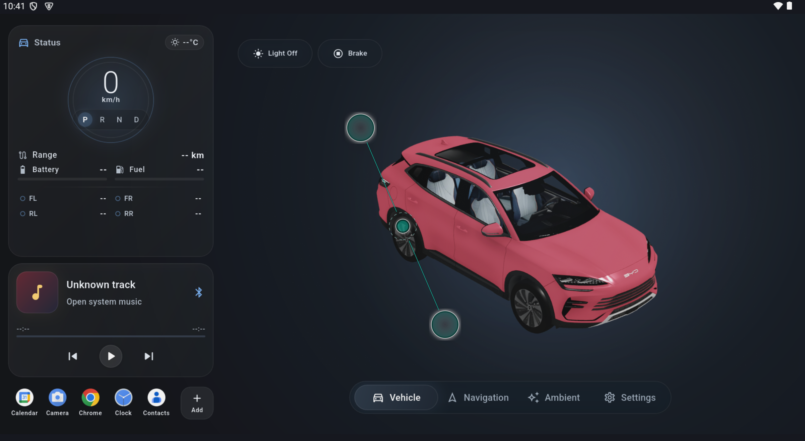
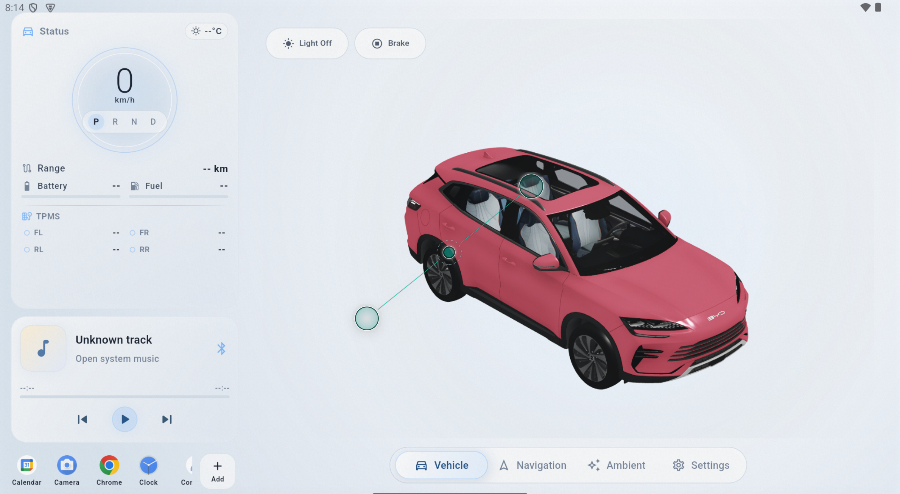
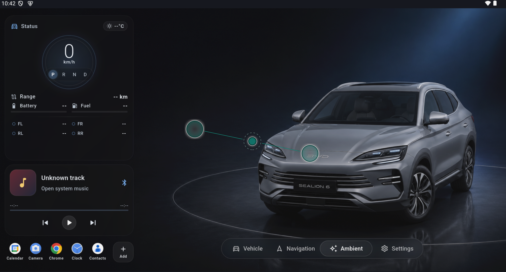

# BYD Launcher

A custom Flutter-based launcher experience designed for BYD / DiLink Android head units.

`byd_launcher` focuses on building a premium in-car home screen with a 3D vehicle view, ambient driving visuals, vehicle status widgets, light/dark themes, favorite apps, and native Android integration for BYD-style system bars and vehicle data bridges.

> This project is community-built and is not affiliated with, endorsed by, or sponsored by BYD Auto, DiLink, or any related OEM.

---

## Preview

```md



```

---

## Key Features

### Premium In-Car Launcher UI

- Full-screen Android Automotive-style launcher experience.
- Optimized layout for large BYD head-unit screens.
- Light mode and dark mode support.
- Glassmorphism-style widgets.
- Favorite apps dock.
- Music/status widgets.
- Ambient page with visual driving environment.
- Custom wallpapers for light and dark modes.

### 3D Vehicle Visualization

- Interactive 3D vehicle model rendering.
- Vehicle model asset support through `assets/models/`.
- Premium ambient rendering around the vehicle.
- Camera/orbit-style model presentation.
- Visual effects for vehicle states such as:
  - Turn signals
  - Lighting state
  - Brake effect
  - Driving/reverse visual feedback

### Vehicle Status UI

Depending on device support and native bridge availability, the launcher can display or react to:

- Speed
- Gear state
- TPMS / tire pressure
- Interior/exterior temperature
- Door/window state
- Light state
- Turn signal state
- Brake state
- Other vehicle-specific states exposed by the native bridge

> Vehicle data availability depends heavily on the BYD firmware version, DiLink version, Android permissions, and whether the native bridge can access the required vehicle signals.

### BYD / DiLink System Bar Handling

The project includes native Android handling for system status/navigation bars because Flutter `SystemChrome` alone may not be stable on some BYD / DiLink builds.

The native bridge is designed to:

- Apply light/dark system bar colors.
- Re-apply system bar settings after activity resume.
- Avoid black system bars in light mode on supported BYD head units.
- Use a Flutter MethodChannel for communication between Dart and Android native code.

### Wallpaper System

The launcher supports custom wallpaper handling:

- Dark mode wallpaper folder.
- Light mode wallpaper folder.
- Fallback wallpaper folder.
- Default bundled assets when no user wallpaper is available.

Recommended structure:

```txt
assets/
  images/
    s6_dark.png
    s6_light.png
  models/
    vehicle_model.glb
```

Optional runtime wallpaper folders may be used depending on your implementation:

```txt
wallpapers/
  dark/
  light/
```

### Android Launcher Support

The project is intended to work as a custom Android launcher on supported BYD / DiLink devices.

Typical launcher behavior includes:

- Home screen activity.
- Android intent filters for launcher usage.
- Option to choose the app as the default launcher from Android settings, depending on firmware restrictions.

---

## Tech Stack

- Flutter
- Dart
- Kotlin
- Android native MethodChannel integration
- `model_viewer_plus` for 3D model rendering
- `provider` for state management
- `get_it` for dependency injection
- `shared_preferences` for local settings
- `permission_handler` for permission flow
- `flutter_animate` for UI animations
- `webview_flutter` for embedded web/native rendering flows where needed
- `vector_math` for 3D/math utilities

---

## Project Structure

A simplified structure may look like this:

```txt
byd_launcher/
├── android/
│   └── app/
│       └── src/
│           └── main/
│               ├── AndroidManifest.xml
│               └── kotlin/
│                   └── byd/
│                       ├── MainActivity.kt
│                       ├── VehicleBridge.kt
│                       ├── SystemBarsBridge.kt
│                       └── other native bridge files
├── assets/
│   ├── images/
│   │   ├── s6_dark.png
│   │   └── s6_light.png
│   └── models/
│       └── vehicle model files
├── lib/
│   └── main.dart
├── pubspec.yaml
└── README.md
```

---

## Requirements

### Development Environment

- Flutter SDK compatible with Dart SDK `^3.11.5`
- Android Studio or VS Code
- Android SDK
- Kotlin/Gradle Android toolchain
- A physical Android device or BYD / DiLink head unit for real testing

### Target Runtime

This project is primarily designed for:

- BYD vehicles using DiLink-based Android head units
- Large landscape Android screens
- Android Automotive-like environments
- Custom launcher use cases

It may also run on:

- Android tablets
- Android emulators
- Generic Android head units

However, vehicle-specific features may not work outside supported BYD / DiLink environments.

---

## Getting Started

### 1. Clone the Repository

```bash
git clone https://github.com/hnguyen0828/byd_launcher.git
cd byd_launcher
```

### 2. Install Dependencies

```bash
flutter pub get
```

### 3. Check Flutter Environment

```bash
flutter doctor
```

Resolve any missing Android SDK, license, or device issues before building.

### 4. Run in Debug Mode

```bash
flutter run
```

For a specific device:

```bash
flutter devices
flutter run -d DEVICE_ID
```

---

## Building APK

### Debug APK

```bash
flutter build apk --debug
```

### Profile APK

Useful for testing performance closer to release mode while keeping some profiling support:

```bash
flutter build apk --profile
```

### Release APK

```bash
flutter build apk --release
```

Output APK path:

```txt
build/app/outputs/flutter-apk/app-release.apk
```

### Split APK by ABI

If you want smaller APKs per CPU architecture:

```bash
flutter build apk --release --split-per-abi
```

> If your Gradle config already defines `abiFilters`, make sure it does not conflict with Flutter ABI splitting.

---

## Installing on Android / BYD Head Unit

### Install with ADB

```bash
adb install -r build/app/outputs/flutter-apk/app-release.apk
```

For profile build:

```bash
adb install -r build/app/outputs/flutter-apk/app-profile.apk
```

### Launch App

```bash
adb shell monkey -p your.package.name 1
```

Replace `your.package.name` with the actual Android package name from your `AndroidManifest.xml` / Gradle config.

---

## Setting as Default Launcher

On supported Android / BYD / DiLink systems:

1. Install the APK.
2. Open Android Settings.
3. Go to Apps / Default Apps / Home App.
4. Select BYD Launcher.
5. Press Home to verify that the launcher opens by default.

Some BYD / DiLink firmware versions may restrict default launcher changes. In that case, additional OEM-specific permissions or manual setup may be required.

---

## Permissions

Depending on your build and feature set, the app may request or require permissions for:

- Querying installed apps
- Launching apps
- Reading system state
- Drawing or rendering over UI areas
- Accessing vehicle-specific native signals
- Storage access for custom wallpapers
- Network/WebView features if enabled

Vehicle-related permissions are device- and firmware-dependent. Some features may only work on actual BYD / DiLink hardware.

---

## BYD / DiLink Notes

BYD / DiLink systems may behave differently from standard Android devices.

Known platform-specific considerations:

- Flutter `SystemChrome` may not fully control OEM system bars.
- System bars may reset after activity resume or after returning from another app.
- Some firmware versions force dark/black system bars unless native flags are re-applied.
- Vehicle signals may not be available through standard Android APIs.
- Some BYD APIs/classes may be firmware-specific.
- A feature working on one BYD model or DiLink version may not work on another.

The project includes native Android bridge code to improve compatibility, but full behavior depends on the actual vehicle system.

---

## System Bars Handling

The app uses a native Android bridge to apply status/navigation bar colors for light and dark mode.

The Dart side can call the native bridge through a MethodChannel similar to:

```dart
const MethodChannel('byd/launcher').invokeMethod(
  'applySystemBars',
  {'dark': true},
);
```

Expected behavior:

- `dark: true` applies dark system bars with light icons.
- `dark: false` applies light system bars with dark icons.

The native implementation may re-apply the settings multiple times after launch or resume because some BYD / DiLink systems override window flags shortly after activity creation.

---

## Vehicle Bridge

The native vehicle bridge is responsible for reading or receiving vehicle-related state and sending it to Flutter.

Depending on your implementation, it may expose data such as:

```txt
speed
gear
turn signal state
light state
brake state
door/window state
TPMS
temperature
```

The Flutter layer should treat these values as optional and defensive:

- Use safe defaults.
- Avoid assuming every vehicle signal exists.
- Avoid blocking the UI while waiting for native data.
- Handle stale or missing data gracefully.

---

## Custom Wallpapers

Recommended behavior:

```txt
wallpapers/dark/   -> used in dark mode
wallpapers/light/  -> used in light mode
wallpapers/        -> fallback folder
assets/images/     -> bundled fallback assets
```

Default fallback assets:

```txt
assets/images/s6_dark.png
assets/images/s6_light.png
```

If no custom wallpaper exists, the app should use the bundled default image for the active theme.

---

## Assets

The project uses Flutter assets configured in `pubspec.yaml`:

```yaml
flutter:
  uses-material-design: true

  assets:
    - assets/models/
    - assets/images/
```

Make sure all model and image files are placed in the correct folders and included in `pubspec.yaml`.

After adding or replacing assets:

```bash
flutter pub get
flutter clean
flutter pub get
```

---

## Development Guidelines

### UI

- Keep layout safe for large landscape screens.
- Test both light and dark mode.
- Avoid hardcoded positions unless they are vehicle-screen specific.
- Keep text readable under strong daylight conditions.
- Avoid placing critical controls near system bars unless safe insets are handled.

### Performance

- Keep 3D model files optimized.
- Compress large images.
- Avoid rebuilding heavy widgets unnecessarily.
- Use throttling/debouncing for frequent vehicle signal updates.
- Avoid polling too aggressively unless real-time behavior is required.
- Test on the actual BYD head unit, not only emulator.

### Vehicle Signal Handling

- Do not assume every signal is real-time.
- Add timestamping if possible.
- Ignore duplicate events.
- Keep left/right signal states independent.
- Always handle native null/error responses safely.
- Avoid animations that continue forever after the native signal is off.

---

## Troubleshooting

### System bars are black in light mode

Try the following:

- Verify native system bar bridge is registered in `MainActivity`.
- Re-apply system bars after `onResume`.
- Make sure the app is not drawing behind opaque system bars unintentionally.
- Check whether the BYD firmware overrides system bar colors.
- Test on the real head unit, not only emulator.

### App content is pushed under the top/bottom bar

Check:

- `WindowCompat.setDecorFitsSystemWindows(...)`
- Flutter `SafeArea`
- Android theme fullscreen flags
- Status/navigation bar transparency
- Root layout padding

### 3D model is slow or laggy

Try:

- Reducing model polygon count.
- Compressing textures.
- Using lower texture resolution.
- Avoiding excessive animation rebuilds.
- Testing profile mode instead of debug mode.

```bash
flutter build apk --profile
```

### APK is too large

Try:

```bash
flutter build apk --release --split-per-abi
```

Also check:

- Large `.glb` / `.gltf` model files
- Large PNG wallpapers
- Unused assets
- Debug/profile symbols
- Unused dependencies

### Vehicle signals do not update

Check:

- Native bridge registration.
- Android permissions.
- BYD / DiLink firmware compatibility.
- Whether the signal exists on your specific vehicle.
- Logs from `adb logcat`.

```bash
adb logcat | grep -i byd
```

### Turn signal animation does not stop

Make sure:

- Left and right signal states are stored independently.
- Off events are handled explicitly.
- Flash state and steady state are not mixed incorrectly.
- UI animation depends on the latest native state, not a fixed timer only.
- Duplicate stale events are ignored.

---

## Testing

Run Flutter analysis:

```bash
flutter analyze
```

Run tests:

```bash
flutter test
```

Build profile APK:

```bash
flutter build apk --profile
```

Build release APK:

```bash
flutter build apk --release
```

Recommended manual test checklist:

- Launch app on emulator.
- Launch app on BYD / DiLink head unit.
- Switch light/dark mode.
- Verify system bars in both modes.
- Open and close other apps.
- Return to launcher.
- Test favorite apps.
- Test wallpaper fallback.
- Test 3D model load time.
- Test turn signals.
- Test brake animation.
- Test gear/speed display.
- Test TPMS display if available.

---

## Contributing

Contributions are welcome.

Before submitting a pull request:

1. Run `flutter analyze`.
2. Run `flutter test`.
3. Test light and dark mode.
4. Test layout on a large landscape screen.
5. Keep BYD-specific behavior behind defensive checks.
6. Avoid breaking generic Android compatibility.
7. Document any firmware-specific behavior.

Recommended pull request format:

```md
## What changed

## Why

## Tested on

- Emulator:
- Android device:
- BYD / DiLink head unit:

## Screenshots / Videos

## Known limitations
```

---

## Roadmap

Possible future improvements:

- Better native vehicle signal abstraction.
- More BYD / DiLink compatibility layers.
- More configurable themes.
- More wallpaper modes.
- Optimized 3D rendering pipeline.
- App drawer improvements.
- Configurable widget layout.
- Improved diagnostics screen.
- Export/import launcher settings.
- More robust default launcher setup flow.

---

## Safety Notice

This launcher is intended for infotainment and customization purposes.

Do not interact with the launcher while driving. Always follow local laws and safety regulations. Vehicle-related visual effects should not distract the driver or interfere with critical system UI, camera, ADAS warnings, or OEM safety screens.

Use this project at your own risk.

---

## Disclaimer

This project is an independent open-source/community project.

It is not affiliated with, endorsed by, sponsored by, or officially supported by:

- BYD Auto
- DiLink
- Kinex
- Any vehicle OEM or supplier

All trademarks, vehicle names, logos, and brand references belong to their respective owners.

---

## License

Choose a license before publishing.

Recommended open-source options:

- MIT License: simple and permissive.
- Apache 2.0: permissive with explicit patent language.
- GPLv3: requires derivative works to remain open source.

Example:

```md
MIT License

Copyright (c) 2026

Permission is hereby granted, free of charge, to any person obtaining a copy
of this software and associated documentation files...
```

Add the full license text in a separate `LICENSE` file.

---

## Author

Created by Nguyen Hoang.

GitHub: `@hnguyen0828`

---

## Acknowledgements

Thanks to the Flutter community and Android developer ecosystem for the tools and libraries used in this project.
